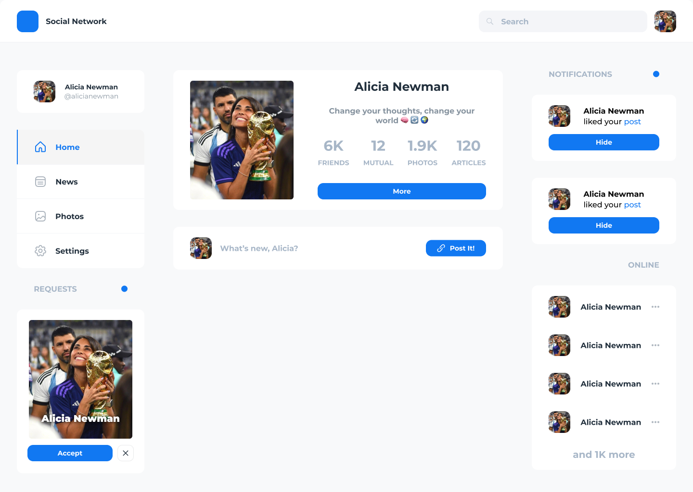

# Social Network 👽

📛[VK](https://www.vk.com/) - Russian famous social network, which has simple design, inspired us to recreate it's main functionality

### 🔗[Live Demo](https://google.com/)

&nbsp;&nbsp;Here are Frontend files, but look through [Backend](https://github.com/Artuchka/social-network-backend) part if you're interested

### 📚About the Project:

Following conventional commits, doing hard work.

### 🧰Technologies Used:

-   ⚛️React⚛️
-   Redux Toolkit
-   Typescript
-   React Router Dom
-   SCSS

#### Extra Techonologies:

-   Webpack self-configured
-   ESlinter
-   Prettier
-   Jest

### 🛠️Setup / Installation:

>

1. clone this repo to your local machine
2. go to desired branch (master)
3. in terminal run following to install dependencies

```
npm i
```

5. to start live server

```
npm run start
```

### 📷Screenshots:



Have you looked all screenshots? 🤯Damn....
You should checkout [💀Full🔗](https://google.com/)

### 📝Team Credits:

This repo is build by:

-   [Senya](https://github.com/brvjeo)
-   [Timur](https://github.com/WhiteAzer)
-   [Temka](https://github.com/Artuchka)

### ©️License:

MIT license @brvjeo @WhiteAzer @Artuchka
